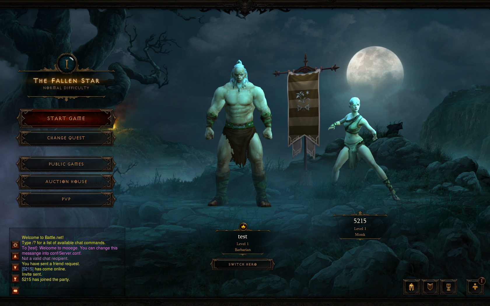

## Добро пожаловать. Это Mooege       
       \------.     _           __      ,-.___     _   _        ,---.  
        \ .--. \    \'-,      ,',.'.     \ ._ \    \'-'/       / .-. \ 
        | |  | |     | |     J /__\ L    | |_)(     | |       f /   \ l
        | |  | |     | |     | |  ] ]    | .-. \    | |   ,   t \   / j
        / '--' /    ,'_'.   .'_'. F F    / |__)/    / '--'/    \ '-' / 
       /_,----'      ' '     ' ' /,'    '-----'    '-----'      '---' 
      ('                        ''                    
> mooege (multi-node object oriented educational game emulator) является эмулятором игрового сервера на открытом исходном коде разработанном на языке C#. Он может быть скомпилирован с помощью Microsoft .NET или Mono, и запущен на Windows, MacOS, и Linux. Пожалуйста прочитайте файл LICENSE для получения информации о лицензии.

Copyright (C) 2011 - 2018 mooege

This program is free software; you can redistribute it and/or
modify it under the terms of the GNU General Public License
as published by the Free Software Foundation; either version 2
of the License, or (at your option) any later version.

This program is distributed in the hope that it will be useful,
but WITHOUT ANY WARRANTY; without even the implied warranty of
MERCHANTABILITY or FITNESS FOR A PARTICULAR PURPOSE.  See the
GNU General Public License for more details.

You should have received a copy of the GNU General Public License
along with this program; if not, write to the Free Software
Foundation, Inc., 51 Franklin Street, Fifth Floor, Boston, MA  02110-1301, USA.

## Инструкция
* Установите [.NET Framework 4](https://www.microsoft.com/en-in/download/details.aspx?id=17718) если не установлен
* Установите [Visual Studio 2017 Community Edition](https://www.visualstudio.com/en/downloads)
* Pick .Net Desktop Development for workload
* Установите [GIT](https://git-scm.com/downloads)
* Запустите консоль
* Перейтите в папку в которой будет храниться исходный код
* Используйте команду: git clone https://github.com/Sh4d0v/mooege.git
* Откройте Visual Studio CE, залогиньтесь, если хотите, File -> open -> project/solution
* Откройте mooege/src/Mooege/Mooege-VS2010.sln
* Загрузите [клиент](https://yadi.sk/d/g_aoGkXE3PACvC) -> Установите
* Загрузите [пропатченный exe-файл](https://mega.nz/#!lcUTzSZY!ugfOa8jldBy9f99gBLjRvoXyZE707Tf49tYkDeNP8kA) -> распакуйте в папку с клиентом
* Скопируйте все файлы MPQs из клиент\Data_D3\PC\MPQs\ - в папку mooege/assets/MPQ
* Теперь вы можете собрать целеком проект CTRL+Shift+B
* Правой кнопкой мыши Mooege-VS2010 project -> Build -> подождите, it will copy all MPQs to build folder
* Теперь жмакаем f5 - Это запустит процесс в режиме Debug и позволит отслеживать ошибки -> используйте брейкпоинты!
* Запускайте клиент
* Введите "Test@" как логин, "123456" как пароль
* Создавайте персонажа и в игру)
* Введите !commands в чат для получения полного списка комманд.
* Начинаем разработку!

## Так-же рекомендуем
* Присоеденяйтесь к обсуждениям: https://discord.gg/ES7G8VV
* Читайте [RageZone Forums](http://ragezone.com/).
* Был воссоздан сервер http://d3reflection.com (Совершенно другой билд mooege. И вообще исходники зажали, и куда-то слились.)
* Рабочая вики: https://github.com/Sh4d0v/mooege/wiki

## Ветки:
* Здесь только одна ветка.
* Да море костылей, все в процессе, постоянно будет меняться и так далее.. И вообще это тупо весело)
